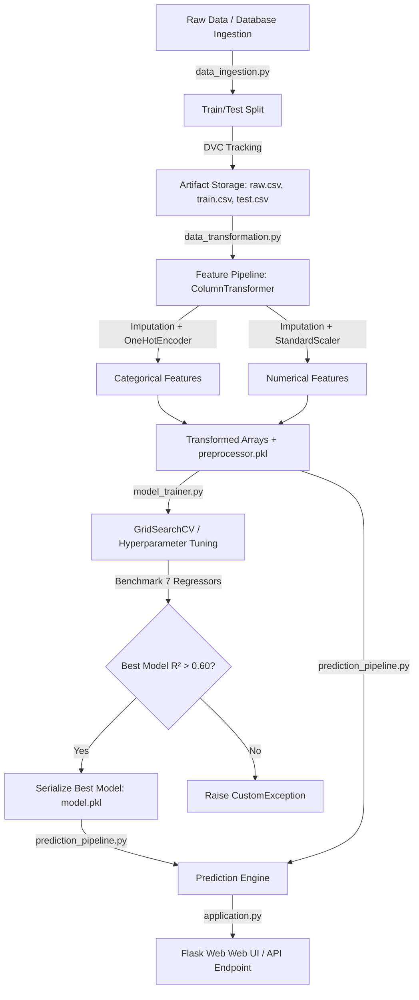

# 🎓 Student Performance Prediction 

[](https://www.python.org/)
[](https://scikit-learn.org/)
[](https://flask.palletsprojects.org/)
[](https://dvc.org/)

> **Production-ready machine learning system that predicts student academic math performance based on demographic, socioeconomic, and preliminary academic metrics. Features a modular OOP codebase, automated model benchmarking & hyperparameter tuning, DVC data versioning, custom logging/exception frameworks, and a Flask web service.**

---

## 📌 Executive Summary & Business Problem

### Business Context & Impact
In educational institutions, early identification of students who may struggle academically is critical for targeted interventions. Traditional methods often flag at-risk students **after** midterm or final evaluations—when intervention options are constrained.

This project builds a predictive analytics framework to forecast student academic performance (specifically **Math Scores**) using key demographic indicators, socioeconomic proxies (e.g., standard vs. free/reduced lunch), test preparation status, and complementary subject scores (Reading & Writing).

### Core Objectives
* **Predictive Precision**: Automatically evaluate and select the highest-performing machine learning model based on $R^2$ performance metrics.
* **Production Engineering**: Move beyond one-off Jupyter notebooks into a modular, testable, and packageable Python software architecture (`mlproject`).
* **Operational Web Interface**: Deliver real-time inference via an intuitive Flask-backed user application.

---

## 🏗️ End-to-End System Architecture

The pipeline follows a modern MLOps architecture designed for reproducibility, modularity, and seamless inference:



---

## 🔬 Dataset & Feature Engineering Pipeline

### Features Matrix
| Feature | Type | Transformation Pipeline | Description |
| :--- | :--- | :--- | :--- |
| `gender` | Categorical | `SimpleImputer(most_frequent)` $\rightarrow$ `OneHotEncoder` | Student gender identity |
| `race_ethnicity` | Categorical | `SimpleImputer(most_frequent)` $\rightarrow$ `OneHotEncoder` | Demographic racial/ethnic group |
| `parental_level_of_education` | Categorical | `SimpleImputer(most_frequent)` $\rightarrow$ `OneHotEncoder` | Parent's highest degree achieved |
| `lunch` | Categorical | `SimpleImputer(most_frequent)` $\rightarrow$ `OneHotEncoder` | Lunch type (Socioeconomic proxy) |
| `test_preparation_course` | Categorical | `SimpleImputer(most_frequent)` $\rightarrow$ `OneHotEncoder` | Completion status of prep course |
| `reading_score` | Numerical | `SimpleImputer(median)` $\rightarrow$ `StandardScaler` | Standardized Reading Test Score |
| `writing_score` | Numerical | `SimpleImputer(median)` $\rightarrow$ `StandardScaler` | Standardized Writing Test Score |
| **`math_score`** | **Target** | Direct Pass-through | **Target variable to predict** |

### Preprocessing Design Highlights
* **Zero Data Leakage**: Transformers are fitted **exclusively on the training split** (`fit_transform`) and subsequently applied to test/validation sets (`transform`).
* **Robust Serialization**: The full transformation state is saved as `artifacts/preprocessor.pkl` to guarantee identical preprocessing during web serving.

---

## 📊 Model Benchmark & Hyperparameter Tuning

The training pipeline dynamically evaluates 7 baseline and ensemble regression algorithms with automated hyperparameter grid tuning:

```
├── Linear Regression
├── Decision Tree Regressor
├── Random Forest Regressor
├── Gradient Boosting Regressor
├── AdaBoost Regressor
├── XGBoost Regressor
└── CatBoost Regressor
```

### Hyperparameter Tuning Matrix

```python
params = {
    "CatBoost Regressor": {"depth": [6, 8, 10], "learning_rate": [0.01, 0.05, 0.1], "iterations": [30, 50, 100]},
    "Random Forest Regressor": {"n_estimators": [8, 16, 32, 64, 128, 256], "criterion": ["squared_error", "absolute_error"]},
    "XGBoost Regressor": {"learning_rate": [0.1, 0.01, 0.05], "n_estimators": [8, 16, 32, 64, 128, 256]},
    "Gradient Boosting Regressor": {"learning_rate": [0.1, 0.01, 0.05], "subsample": [0.6, 0.7, 0.8, 0.9]},
    "AdaBoost Regressor": {"learning_rate": [0.1, 0.01, 0.5], "loss": ["linear", "square", "exponential"]}
}
```

### Evaluation Strategy
* **Automated Selection**: The `ModelTrainer` automatically ranks models based on test set $R^2$ score.
* **Production Guardrail**: Enforces a strict quality threshold ($R^2 \ge 0.60$). If no candidate model achieves this benchmark, a `CustomException` halts deployment artifact generation.
* **Top Result**: High test $R^2$ score ($\sim 0.88+$) achieved via Linear Regression / Ensemble algorithms.

---

## 🛠️ Repository & Project Structure

```
Student-Performance-Prediction-Project/
│
├── .dvc/                         # Data Version Control metadata
├── artifacts/                    # Serialized models, scalers, and split datasets
│   ├── model.pkl                 # Trained & tuned best regression model
│   ├── preprocessor.pkl          # Scikit-Learn ColumnTransformer object
│   ├── raw.csv                   # Full dataset snapshot
│   ├── train.csv                 # Training split
│   └── test.csv                  # Testing split
│
├── notebooks/                    # Research & Exploratory Data Analysis
│   ├── 1. EDA STUDENT PERFORMANCE.ipynb
│   └── 2. MODEL TRAINING.ipynb
│
├── src/mlproject/                # Core Production Python Package
│   ├── components/               # Modular Pipeline Components
│   │   ├── data_ingestion.py     # Data retrieval, train/test splitting
│   │   ├── data_transformation.py# Pipeline construction & feature scaling
│   │   └── model_trainer.py      # Model benchmarking & serialization
│   │
│   ├── pipelines/                # Execution & Inference Pipelines
│   │   ├── training_pipeline.py  # End-to-end training orchestrator
│   │   └── prediction_pipeline.py# Real-time web scoring pipeline
│   │
│   ├── exception.py              # Custom Exception handler with traceback detail
│   ├── logger.py                 # Centralized logging engine
│   └── utils.py                  # Helper utilities (save/load obj, model eval)
│
├── templates/                    # HTML Interfaces for Flask
│   ├── index.html                # Landing page
│   └── prediction.html           # Interactive prediction web form
│
├── application.py                # Flask Web Application entry point
├── main.py                       # Command line training orchestrator
├── Dockerfile                    # Containerization manifest
├── requirements.txt              # Project dependencies
└── setup.py                      # Package configuration (pip install -e .)
```

---

## ⚡ Quickstart Guide & Installation

### Prerequisites
* **Python 3.8+** installed on your system.
* **Git** and **Virtualenv**.

### 1. Clone & Set Up Environment
```bash
# Clone repository
git clone https://github.com/your-username/Student-Performance-Prediction-Project.git
cd Student-Performance-Prediction-Project

# Create virtual environment
python -m venv venv

# Activate virtual environment
# Windows:
.venv\Scripts\activate
# Linux/macOS:
source venv/bin/activate
```

### 2. Install Dependencies & Local Package
```bash
pip install -r requirements.txt
```
> *Note: Running `requirements.txt` automatically builds and installs the `mlproject` package in editable mode via `setup.py` (`-e .`).*

### 3. Run Training Pipeline
Execute the full training pipeline to perform data ingestion, feature engineering, hyperparameter tuning, and model serialization:
```bash
python main.py
```

### 4. Launch Web Application
Start the Flask development server:
```bash
python application.py
```
Open your browser and navigate to: `http://127.0.0.1:5000/predict-data`

---

## 🖥️ Web Interface & API Usage

### Interactive Web UI
Users can input student parameters through the intuitive web form to receive instant math score predictions:

```
[ Input Parameters ]
• Gender: Female
• Race / Ethnicity: Group B
• Parental Level of Education: Bachelor's Degree
• Lunch Type: Standard
• Test Prep Course: Completed
• Reading Score: 85
• Writing Score: 88

───> [ Predict Target ] ───> Calculated Predicted Math Score: 87.4
```

### Python Programmatic Scoring API
```python
from src.mlproject.pipelines.prediction_pipeline import CustomData, PredictionPipeline

# 1. Instantiate input object
data = CustomData(
    gender="female",
    race_ethnicity="group B",
    parental_level_of_education="bachelor's degree",
    lunch="standard",
    test_preparation_course="completed",
    reading_score=85,
    writing_score=88
)

# 2. Convert to DataFrame
df = data.get_data_as_df()

# 3. Run inference pipeline
pipeline = PredictionPipeline()
predicted_score = pipeline.prediction(df)
print(f"Predicted Math Score: {predicted_score[0]:.2f}")
```

---

## 🔑 Key Engineering Standards & Best Practices

1. **Custom Exception Framework (`exception.py`)**:
   Captures precise error location context (file name, line number, exception traceback) to accelerate debugging in production.
2. **Centralized Logging Engine (`logger.py`)**:
   Automatically logs every pipeline step, timestamp, and metadata into file-rotated log stores inside `logs/`.
3. **Data & Model Version Control (`DVC`)**:
   Tracks data dependencies (`raw.csv.dvc`) preventing raw data drift and enabling git-backed data lineage.
4. **Clean Code & Modularity**:
   Strict adherence to SOLID software design principles, separating configuration data classes (`@dataclass`) from business logic execution.

---

## 📜 License
Distributed under the MIT License. See `LICENSE` for more details.

---

## 👨‍💻 Author & Contact
* **Data Scientist / Engineer**: Student Performance Analytics Team
* **GitHub**: [@your-username](https://github.com/your-username)
* **LinkedIn**: [Your LinkedIn Profile](https://linkedin.com/in/your-profile)
